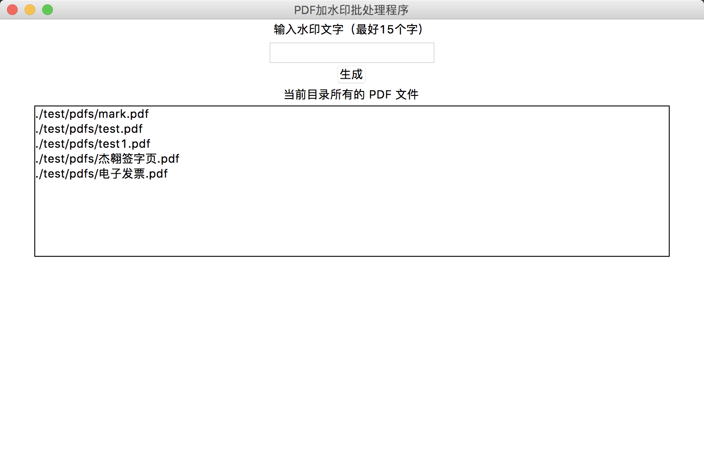
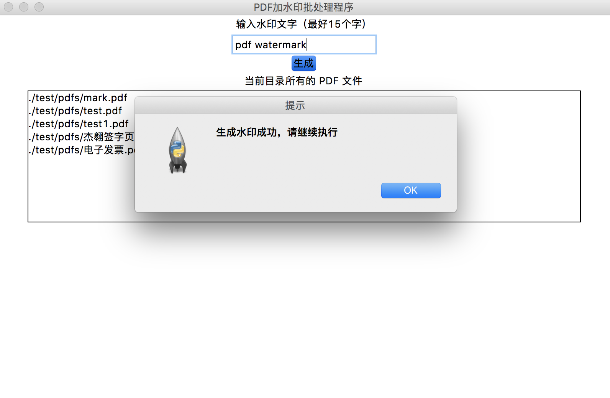
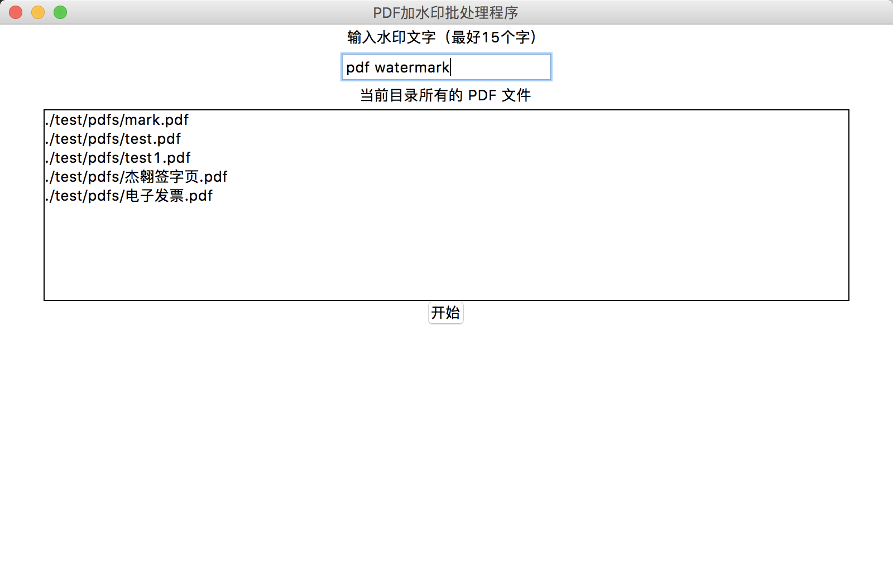
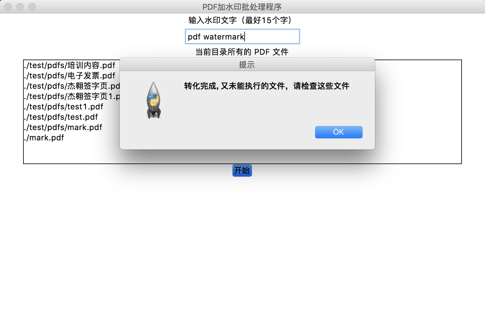
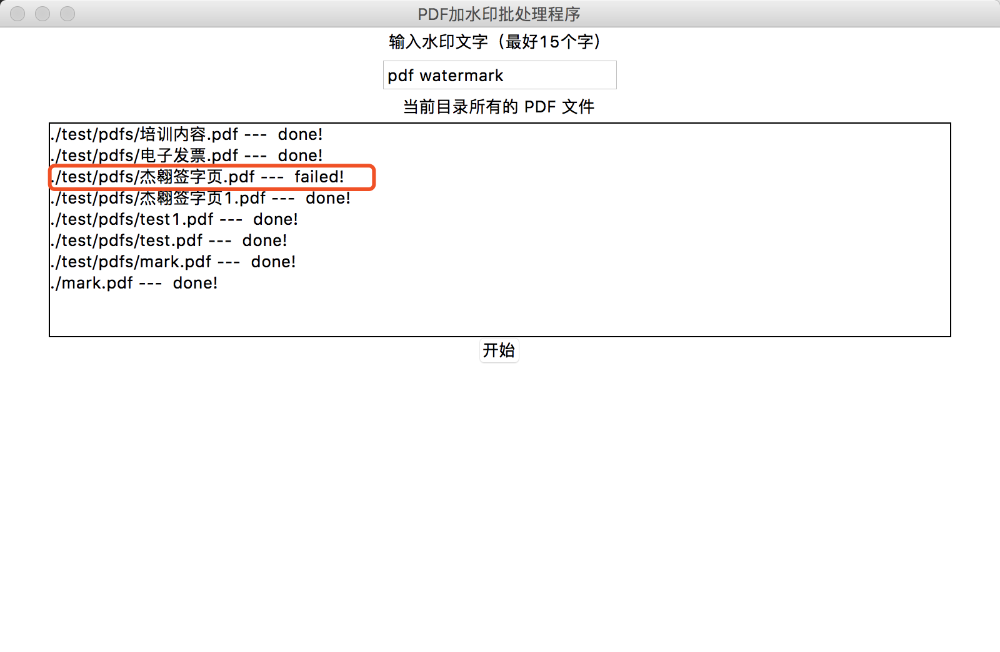

# PDF-Watermark

PDF 文件批处理加水印程序

- 用户自定义生成水印文案
- 自动处理目录下所有PDF文件（包含多级子目录）

## 使用指南

### Step 1

[下载](https://github.com/Here21/PDF-Watermark/releases)`pdf-watermark.exe`放到**需要处理的目录下**，双击打开程序。

可以看到程序会罗列出待处理的文件：

### Step 2

输入水印文字，生成水印文件

这时可以看到程序同级目录中多了一个`mark.pdf`文件，这个就是生成的PDF水印文件。

**提示：**

如果希望使用更定制化的水印文件，可以自行创建期望的水印文件，保存为`PDF`格式，替换此处的`mark.pdf`文件即可。

### Step 3

点击开始按钮开始执行自动处理程序：

等待完成，根据提示查看信息：

如果文件名后面是**failed**标识，说明文件执行未成功，请检查以下问题：
- 文件是否带密码
- 文件是否有内容
- 文件是否损坏

以上问题解决方案为自行修改文件已满足批处理程序。

排除以上问题，则可能是下列问题导致：
- pdf文件由其他程序所创建，可能文件编码格式不同

该问题解决方案，使用PDF阅读器查看，重新保存为PDF文件，替换源文件即可。（尽量使用主流的PDF阅读器）
